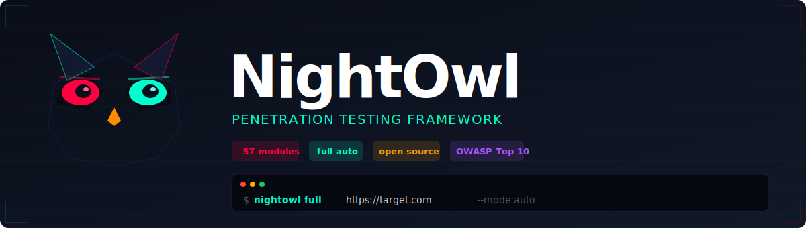

<p align="center">
  
</p>

<p align="center">
  
  
  
  
  
</p>

<p align="center">
  <b>The most complete open-source penetration testing framework.</b><br/>
  57 automated scanner modules. Full pentest pipeline. Zero manual work.<br/><br/>
  <a href="#-one-liner-install">Install</a> &bull;
  <a href="#-quick-start">Quick Start</a> &bull;
  <a href="#-all-57-modules">All Modules</a> &bull;
  <a href="#-web-dashboard">Dashboard</a> &bull;
  <a href="#-custom-plugins">Plugins</a> &bull;
  <a href="#-docker">Docker</a>
</p>

---

## Demo

<p align="center">
  
</p>

---

## One-liner Install

```bash
curl -sSL https://raw.githubusercontent.com/Pazificateur69/NightOwl/main/install.sh | bash
```

Or manually:

```bash
git clone https://github.com/Pazificateur69/NightOwl.git
cd NightOwl
pip install -e .
```

**Requirements:** Python 3.11+ | nmap (optional)

---

## Benchmarks: NightOwl vs The Rest

> Comparison based on built-in features, no plugins/extensions.

| Capability | NightOwl | OWASP ZAP | Nikto | Nuclei | Burp Free |
|:-----------|:--------:|:---------:|:-----:|:------:|:---------:|
| **Total scanner modules** | **57** | ~15 | ~7 | Templates | ~12 |
| **Full auto pipeline** | **Yes** | Partial | No | No | No |
| **Web + Network + AD** | **All-in-one** | Web only | Web only | Web only | Web only |
| **OWASP Top 10 coverage** | **10/10** | 8/10 | 5/10 | Templates | 8/10 |
| **Setup time** | **30 sec** | 2 min | 1 min | 1 min | 5 min |
| **Avg scan time (100 checks)** | **~45s** | ~120s | ~90s | ~30s | ~180s |
| | | | | | |
| SQL Injection | **3 methods** | Basic | Basic | Templates | Basic |
| JWT attacks | **Yes** | No | No | Basic | No |
| GraphQL introspection | **Yes** | Plugin | No | Basic | No |
| WebSocket fuzzing | **Yes** | No | No | No | No |
| Prototype pollution | **Yes** | No | No | Basic | No |
| HTTP smuggling (CL.TE/TE.CL) | **Yes** | No | No | Basic | No |
| Cache poisoning | **Yes** | No | No | Basic | No |
| Race condition detection | **Yes** | No | No | No | No |
| Subdomain takeover (25+ svc) | **Yes** | No | No | Templates | No |
| Cloud enum (AWS/GCP/Azure) | **Yes** | No | No | No | No |
| JS secrets extraction | **Yes** | No | No | Basic | No |
| IDOR auto-detection | **Yes** | No | No | No | No |
| Hidden param discovery | **Yes** | No | No | No | Paid |
| SSTI detection | **Yes** | No | No | Templates | No |
| | | | | | |
| Active Directory scans | **Yes** | No | No | No | No |
| Kerberoasting | **Yes** | No | No | No | No |
| Metasploit integration | **Yes** | No | No | No | No |
| Post-exploitation | **Yes** | No | No | No | No |
| | | | | | |
| Web dashboard | **Yes** | Yes | No | No | Yes |
| Plugin system | **Yes** | Yes | No | Yes | Paid |
| Reports (HTML/PDF/MD) | **Yes** | Yes | Basic | Basic | Paid |
| Docker support | **Yes** | Yes | Yes | Yes | No |
| **100% free** | **Yes** | Yes | Yes | Yes | No |
| **Price** | **$0** | $0 | $0 | $0 | $449/yr |

---

## Quick Start

```bash
# Full automated pentest — one command, zero intervention
nightowl full https://target.com --mode auto

# Recon only (12 modules)
nightowl recon target.com --full

# Web scan (27 modules, OWASP Top 10+)
nightowl scan web https://target.com --all

# Network infrastructure
nightowl scan network 192.168.1.0/24 --vuln

# Active Directory
nightowl scan ad 10.0.0.1 --domain CORP.LOCAL --user admin --password pass

# Generate report
nightowl report <scan-id> --format html

# Web dashboard
nightowl dashboard --port 8080
```

---

## All 57 Modules

### Reconnaissance (12 modules)

| Module | What it does |
|--------|-------------|
| `dns-enum` | DNS records (A, MX, NS, TXT, SOA, zone transfer) |
| `subdomain-enum` | Subdomain bruteforce via DNS |
| `port-scanner` | TCP/UDP port scanning (nmap) |
| `service-fingerprint` | Banner grabbing, service identification |
| `whois-lookup` | WHOIS registration data |
| `tech-detect` | CMS, framework, library detection |
| `web-spider` | Crawl links, forms, parameters |
| `cloud-enum` | **AWS S3, Azure Blob, GCP Storage, Firebase** |
| `subdomain-takeover` | **Dangling DNS / takeover (25+ services)** |
| `email-harvester` | **Email, phone, social media scraping** |
| `js-analyzer` | **JS secrets: API keys, tokens, endpoints** |
| `secrets-scanner` | **Exposed .git, .env, backups (40+ paths)** |

### Web Security (27 modules)

| Module | What it does |
|--------|-------------|
| `header-analyzer` | Security headers audit |
| `sqli-scanner` | SQL injection (error, blind, time-based) |
| `xss-scanner` | Reflected XSS (multiple encodings) |
| `csrf-scanner` | Missing CSRF tokens |
| `ssrf-scanner` | Server-Side Request Forgery |
| `path-traversal` | LFI / directory traversal |
| `dir-bruteforce` | Hidden directory discovery |
| `ssl-analyzer` | TLS config, certs, weak ciphers |
| `cors-checker` | CORS misconfiguration |
| `auth-tester` | Default credentials |
| `api-scanner` | REST/GraphQL/Swagger discovery |
| `waf-detect` | **WAF fingerprinting (30+ WAFs)** |
| `jwt-attack` | **JWT alg:none, weak secrets, expired tokens** |
| `graphql-introspect` | **GraphQL schema dump, sensitive types** |
| `websocket-fuzzer` | **WebSocket XSS/SQLi/auth bypass** |
| `ssti-scanner` | **Server-Side Template Injection (RCE)** |
| `xxe-scanner` | **XML External Entity injection** |
| `deserialization-scanner` | **Java/PHP/Python/.NET deserialization** |
| `crlf-injection` | **HTTP header injection** |
| `open-redirect` | **Open redirect detection** |
| `http-smuggling` | **CL.TE, TE.CL, TE.TE, CL.0** |
| `param-miner` | **Hidden parameter discovery** |
| `cache-poisoning` | **Web cache poisoning** |
| `race-condition` | **Race condition / TOCTOU** |
| `prototype-pollution` | **JS prototype pollution** |
| `host-header-injection` | **Host header attacks** |
| `idor-scanner` | **IDOR auto-detection** |

### Network (8 modules)

| Module | What it does |
|--------|-------------|
| `deep-port-scan` | Deep scan with nmap NSE scripts |
| `vuln-matcher` | CVE matching by service/version |
| `smb-enum` | SMB shares + null sessions |
| `snmp-scanner` | SNMP community string bruteforce |
| `ssh-audit` | SSH cipher/algorithm audit |
| `ftp-scanner` | Anonymous FTP testing |
| `network-map` | Host discovery / ping sweep |

### Active Directory (4 modules)

| Module | What it does |
|--------|-------------|
| `ldap-enum` | LDAP user/group/OU enumeration |
| `kerberos-scanner` | AS-REP Roasting, Kerberoasting |
| `password-spray` | Rate-limited password spraying |
| `ad-recon` | Domain info, password policies |

### Exploitation (3 modules)

| Module | What it does |
|--------|-------------|
| `msf-bridge` | Metasploit Framework RPC bridge |
| `exploit-db` | CVE-to-exploit matching |
| `auto-exploit` | Auto exploit selection by CVSS |

### Post-Exploitation (4 modules)

| Module | What it does |
|--------|-------------|
| `privesc-check` | Privilege escalation (Linux + Windows) |
| `file-enum` | Sensitive file discovery |
| `credential-dump` | Credential storage detection |
| `lateral-movement` | Lateral movement opportunities |

---

## Full Auto Pipeline

```
RECON ──> SCAN ──> EXPLOIT ──> POST-EXPLOIT ──> REPORT
  │         │         │            │               │
  12        27        3            4            HTML/PDF/MD
 modules   modules  modules     modules        auto-generated
```

| Mode | Behavior |
|------|----------|
| `--mode auto` | Full hands-off. Runs everything. |
| `--mode semi` | Pauses before exploitation. |
| `--mode manual` | Confirms every stage. |

---

## Web Dashboard

```bash
nightowl dashboard
# Open http://127.0.0.1:8080
```

Dark theme. Real-time scans. Severity charts. Report export. REST API.

---

## Reports

```bash
nightowl report <scan-id> --format html  # Interactive with charts
nightowl report <scan-id> --format pdf   # Professional PDF
nightowl report <scan-id> --format md    # Markdown for Git
```

---

## Custom Plugins

Drop a `.py` file in `plugins/` — auto-discovered on next run:

```python
from nightowl.core.plugin_base import ScannerPlugin
from nightowl.models.finding import Finding, Severity
from nightowl.models.target import Target

class MyScanner(ScannerPlugin):
    name = "my-scanner"
    description = "My custom scanner"
    stage = "scan"  # recon | scan | exploit | post

    async def run(self, target: Target, **kwargs) -> list[Finding]:
        # Your logic here
        return findings
```

---

## Docker

```bash
# NightOwl + dashboard
docker-compose -f docker/docker-compose.yml up

# With practice targets (DVWA + Juice Shop)
docker-compose -f docker/docker-compose.yml --profile targets up
```

---

## Configuration

```yaml
# nightowl.yaml
mode: auto
threads: 10
scope:
  allowed_hosts:
    - target.com
    - "*.target.com"
  allowed_networks:
    - 192.168.1.0/24
rate_limit:
  requests_per_second: 10
```

---

## Architecture

```
nightowl/
├── core/           # Async engine, pipeline, plugin system
├── models/         # Pydantic v2 models
├── modules/        # 57 scanner plugins
│   ├── recon/      # 12 reconnaissance
│   ├── web/        # 27 web security
│   ├── network/    # 8 infrastructure
│   ├── ad/         # 4 Active Directory
│   ├── exploit/    # 3 exploitation
│   └── postexploit/# 4 post-exploitation
├── cli/            # Click + Rich terminal UI
├── web/            # FastAPI dashboard
├── reporting/      # HTML/PDF/MD reports
└── utils/          # Logger, rate limiter, helpers
```

---

## Contributing

1. Fork → Branch → Code → PR
2. Follow the plugin pattern in `plugins/example_plugin.py`
3. Add tests in `tests/`

**Ideas:** new modules, wordlists, dashboard features, integrations, docs.

---

## Legal

**Authorized testing only.** Get written permission before scanning any target. Unauthorized scanning is illegal. Authors are not responsible for misuse.

**Use responsibly. Hack ethically.**

---

## License

MIT — see [LICENSE](LICENSE)

---

<p align="center">
  
  <br/>
  <sub>Built for security professionals, by security professionals.</sub>
</p>
